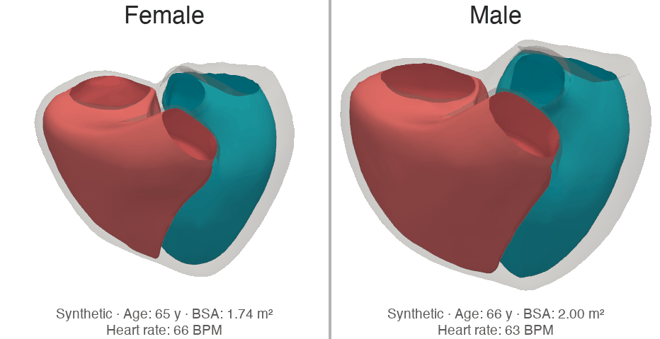
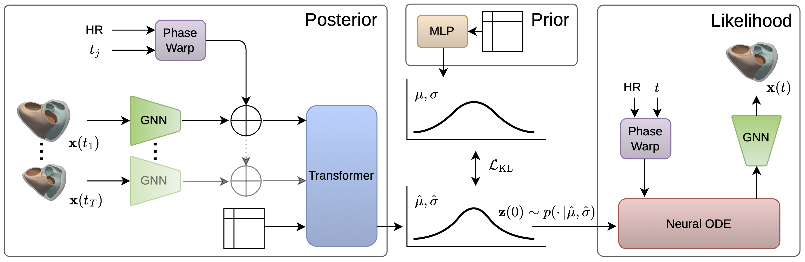

<h1 align="center">A Latent ODE Approach to Spatiotemporal Modeling of Cine Cardiac MRI</h1>

<p align="center"></p>

A deep generative model that learns compact latent representations of 3D+T cardiac mesh motion sequences. Given a time-series of biventricular surface meshes, a variational encoder maps the full trajectory to a low-dimensional latent code; a neural ODE decoder reconstructs it. The resulting embeddings are used for downstream cardiovascular risk modelling and survival analysis. Developed using cardiac imaging data from the [UK Biobank](https://www.ukbiobank.ac.uk/).



## Installation

```bash
# 1. Install PyTorch (adjust the CUDA version as needed)
pip install torch==2.12.0 --index-url https://download.pytorch.org/whl/cu132

# 2. Install the package in editable mode
pip install -e .
```

Define two environment variables:

```bash
export DATA_DIR=/path/to/data/directory
export SAVE_DIR=/path/to/output/and/log/directory
```

## Data preparation

### 1. Mesh Extraction

Use the [biv-me](https://github.com/UOA-Heart-Mechanics-Research/biv-me) pipeline to create cardiac meshes. After running it, the file layout expected by this repo is:

```
$DATA_DIR/
├── raw/
│   ├── ukb******.csv     # raw tabular data
│   └── bulk/
│       ├── <EID>/
│       │   ├── sax/      # contains raw DCM slices
│       │   └── lax/      # contains raw DCM slices
│       ├── ...
│       ...
└── biv-me/
    ├── fitted-models/
    │   ├── <EID>/
    │   ├── ...
    │   ...
    ├── guidepoints/
    │   ├── <EID>/
    │   ├── ...
    │   ...
    └── analysis/lvrv_volumes.csv
```

Notes:

* We only use data from UK Biobank instance 2, so \<EID\> is unique.
* Make sure to run `compute_volume.py` in biv-me to get `lvrv_volumes.csv`

### 2. Cohort Definition

**Note: Even if a UK Biobank data download exemption has been granted, this step must be done on the [Research Analysis Platform (RAP)](https://www.ukbiobank.ac.uk/use-our-data/research-analysis-platform/) to protect health outcome data privacy.**

```bash
# NOTE: THIS SCRIPT IS IN PREPARATION
python -m cardiac_latent_ode.preprocessing.extract_outcomes \
    --outcomes-file $DATA_DIR/preprocessed/outcomes.csv

python -m cardiac_latent_ode.preprocessing.define_cohort \
    --bivme-fitted-models-dir $DATA_DIR/biv-me/fitted-models \
    --volume-file $DATA_DIR/biv-me/analysis/lvrv_volumes.csv \
    --outcomes-file $DATA_DIR/preprocessed/outcomes.csv
```

Output of this step should be an `outcomes.csv` and a `cohort.csv` file. In case of a download exemption, `cohort.csv` can be copied to the HPC (but **not** `outcomes.csv`).

### 3. Preprocessing

Run the preprocessing pipeline:

```bash
# 1. Extract demographics from UKBB tabular data
python -m cardiac_latent_ode.preprocessing.extract_demographics \
    --cohort-file $DATA_DIR/preprocessed/cohort.csv \
    --ukbb-csv $DATA_DIR/raw/ukb******.csv

# 2. Smooth meshes temporally
python -m cardiac_latent_ode.preprocessing.mesh_smoothing \
    --bivme-output-dir $DATA_DIR/biv-me

# 3. Build the template mesh (Procrustes-aligned mean shape)
python -m cardiac_latent_ode.preprocessing.create_template \
    --bivme-output-dir $DATA_DIR/biv-me \
    --cohort-file $DATA_DIR/preprocessed/cohort.csv \
    --max-cases 1000

# 4. Register all meshes to the template and pack into HDF5
python -m cardiac_latent_ode.preprocessing.process_meshes \
    --bivme-output-dir $DATA_DIR/biv-me \
    --bulk-dir $DATA_DIR/raw/bulk \
    --cohort-file $DATA_DIR/preprocessed/cohort.csv

# 5. Compute clinical markers (volumes, EF, strain, …)
python -m cardiac_latent_ode.preprocessing.compute_clinical_markers \
    --h5-data-path $DATA_DIR/preprocessed/meshes.h5 \
    --batch-size 24
```

After processing, you should have the following files:

```
$DATA_DIR/
└── preprocessed/
    ├── cohort.csv             # case IDs, split labels
    ├── demographics.csv       # age, sex, ...
    ├── clinical_markers.csv   # volumes, EF, strain, ...
    ├── template_mesh.vtk      # mean mesh template
    └── meshes.h5              # cardiac mesh data
```

## Training

```bash
# Standard training run
python -m cardiac_latent_ode.train

# Resume from a checkpoint
python -m cardiac_latent_ode.train ckpt_path=<path/to/last.pt>

# Override any config key (Hydra syntax)
python -m cardiac_latent_ode.train model.loss_fn.beta=10.0 trainer.max_epochs=200
```

## Evaluation

```bash
python -m cardiac_latent_ode.eval ckpt_path=<path/to/best.pt>
```

Reports reconstruction error (Euclidean distance + surface-normal angle + vertex acceleration), generation MMD, temporal smoothness, and Wasserstein distance over clinical markers.

## Inference / prediction

```bash
# Export latent embeddings for the full dataset
python -m cardiac_latent_ode.predict ckpt_path=<path/to/best.pt>

# Export reconstructed mesh sequences for a subset of the test split
python -m cardiac_latent_ode.predict ckpt_path=<path/to/best.pt> \
    mode=mesh inference_split=test max_samples=5
```

Latent mode writes `latents.npz`; mesh mode writes per-case `.vtk` frames to the output directory.

## Survival analysis

**Note: Even if a UK Biobank data download exemption has been granted, this step must be done on the [Research Analysis Platform (RAP)](https://www.ukbiobank.ac.uk/use-our-data/research-analysis-platform/) to protect health outcome data privacy.**

See [notebooks/survival_analysis.ipynb](notebooks/survival_analysis.ipynb).

The notebook implements a two-step Cox regression pipeline:

1. **Risk-score derivation** (fit on train split) — a sex-stratified Cox model with spline-expanded latent features derives a scalar *latent risk score*; a parallel model on 7 CMR markers + age, BSA derives a *CMR risk score*.
2. **Downstream evaluation** — each scalar score is added to PCP-HF covariates and a Cox PH model is fit with CV-tuned penalizer, then evaluated on the test split via C-index, AUROC at 3 and 5 years, and Expected/Observed ratio.

**Prerequisites:** run `predict` first (latent mode) to produce `latents.npz`, and ensure `outcomes.csv`, `cohort.csv`, `demographics.csv`, and `clinical_markers.csv` are available.

## Use the model for meshes with a different topology

The model architecture is not tied to a specific mesh topology — it can be retrained on any biventricular surface mesh dataset by following the same preprocessing and training steps above.

However, the evaluation and prediction pipelines rely on two asset files (`landmark_indices_bundle.npz`, `mesh_remap_bundle.npz`) that encode topology-specific information (landmark indices and spiral convolution transforms) derived from the template mesh. These must be regenerated to match your mesh topology before running `eval` or `predict`.

The notebook [notebooks/explore_assets.ipynb](notebooks/explore_assets.ipynb) walks through how to inspect the existing assets and create new ones for a different topology.

## License

MIT — see [LICENSE](LICENSE).
